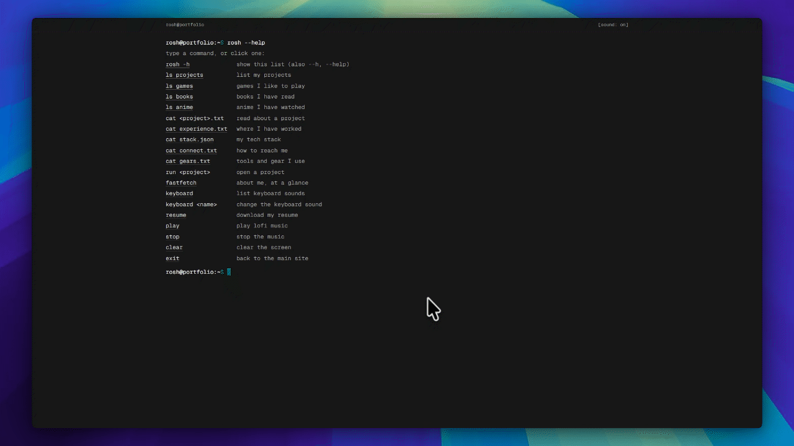

# rosh-terminal

A browser-based interactive terminal portfolio. Instead of a traditional portfolio website, this project presents the owner's work through a fake Unix-like shell: visitors type commands (or click them) to print information about projects, experience, skills, and contact links.

**Live demo:** [cli.iamjustrosh.in](https://cli.iamjustrosh.in) · Main site: [iamjustrosh.in](https://iamjustrosh.in)

 

## Features

- **Type or click.** Every command in the output is clickable, so it works on phones with no keyboard shortcuts needed.
- **Feels like a terminal.** `rosh --help` runs by itself on load, output prints line by line, and the prompt returns when it finishes. Any key skips the animation.
- **Real keyboard shortcuts.** Up and down arrows step through your command history; Tab completes commands and arguments.
- **Mechanical keyboard sounds.** A sound on every key press (never on output), with switchable sound packs via the `keyboard` command.
- **Lofi music.** `play` and `stop`, with fades. The now-playing track shows in the status bar.
- **`fastfetch` card** with your logo, age (always calculated from your date of birth) and summary.
- **Accessible.** Screen-reader friendly output, real buttons and links, a visible sound toggle, and reduced-motion support.
- **Mobile friendly.** Handles the on-screen keyboard so the prompt never hides behind it.
- **Privacy-friendly analytics** (optional, off by default). See [Analytics](#analytics-umami).
- **A few hidden commands** to discover.

## Quick Start

```bash
# 1. Install dependencies (uses Bun, but npm works too)
bun install         # or: npm install

# 2. Start the dev server
bun run dev         # or: npm run dev
# → http://localhost:5173

# 3. Run the test suite
bun run test        # or: npm test
```

### Scripts

| Script | What it does |
|---|---|
| `dev` | Start the dev server |
| `build` | Typecheck, then build for production into `dist/` |
| `preview` | Serve the production build locally |
| `typecheck` | TypeScript check only |
| `test` | Run all tests once (Vitest) |

`dev`, `build`, `typecheck` and `test` first run `scripts/keyboard-packs.mjs`, which scans `public/audio/keys/` for keyboard sound packs (see [Sound](#sound)). It uses Node, so Node must be installed even if you use Bun.

## Commands

Visitors can type these or click them. `help` and `?` also work for `rosh -h`.

| Command | What it does |
|---|---|
| `rosh -h` (or `--h`, `--help`, `help`, `?`) | List the commands |
| `ls` | List what `ls` can show; `ls projects`, `ls games`, `ls books`, `ls anime` print each list |
| `cat` | List the files; `cat <project>.txt`, `cat experience.txt`, `cat stack.json`, `cat connect.txt`, `cat gears.txt` print them |
| `run <project>` | Open a project in a new tab |
| `resume` | Download the resume |
| `fastfetch` | About card with the logo |
| `keyboard`, `keyboard <name>` | List keyboard sounds / switch to one (remembered between visits) |
| `play`, `stop` | Start and stop the lofi track |
| `history` | The commands run this session (click one to run it again) |
| `clear` | Clear the screen |
| `exit` | Fade out and go to the main site |

**Keyboard:** `↑` / `↓` walk through this session's commands (kept in memory only). `Tab` completes the command, then its argument, and a second `Tab` lists the options. Tab only acts when something is typed; on an empty prompt it moves focus as usual, so keyboard-only visitors can still reach the clickable items.

## Environment Variables

Copy `.env.example` to `.env` and fill it in:

```
VITE_MAIN_SITE_URL=https://your-main-site.com   # where `exit` redirects
VITE_SITE_URL=https://your-terminal-site.com    # used in og:url meta tag (no trailing slash)
VITE_UMAMI_WEBSITE_ID=                          # optional: turns analytics on
# VITE_UMAMI_SRC=https://your-umami-host/script.js   # optional: only if you self-host Umami
```

Variables are baked in at build time, so redeploy after changing them.

## How to Customize

All portfolio content and runtime configuration lives in `src/data/`. **You do not need to edit any React components or engine logic to personalize the terminal.**

| File | Controls |
|---|---|
| `src/data/config.ts` | Main settings: URLs, resume file, logo, default keyboard sound pack and volume, lofi track |
| `src/data/profile.ts` | Fastfetch card data |
| `src/data/projects.ts` | Your projects list (`ls projects`, `cat <slug>.txt`, `run <slug>`). Slugs are lowercase kebab-case and are what visitors type |
| `src/data/experience.ts` | Work experience (`cat experience.txt`) |
| `src/data/stack.ts` | Tech stack (`cat stack.json`) |
| `src/data/links.ts` | Contact info (`cat connect.txt`) |
| `src/data/gears.ts` | Tools and gear (`cat gears.txt`) |
| `src/data/games.ts`, `books.ts`, `anime.ts` | The `ls games`, `ls books`, `ls anime` lists |
| `src/data/fortunes.ts` | Lines for a hidden command |

Files to replace in `public/`: `logo.svg` (transparent SVG or PNG), `resume.pdf`, `og.png` (the 1200×630 link-preview image) and `favicon.svg`.

Adding a project, a list entry or a keyboard pack never requires touching code: command completion, `ls` and `cat` pick them up automatically.

## Sound

**Keyboard sounds.** Copy sound-pack folders into `public/audio/keys/`, then restart the dev server. Nothing else to edit: the scanner finds them, and `keyboard` lists exactly what is installed.

```
public/audio/keys/<pack>/
  press/    GENERIC_R0.mp3 … GENERIC_Rn.mp3, BACKSPACE.mp3, ENTER.mp3, SPACE.mp3
  release/  GENERIC.mp3, BACKSPACE.mp3, ENTER.mp3, SPACE.mp3   (only used if playRelease is on)
```

- A pack needs `press/BACKSPACE.mp3`, `ENTER.mp3`, `SPACE.mp3` and at least one `GENERIC_R<n>.mp3`. An incomplete pack is skipped, and the scanner prints which files are missing.
- Visitors download only the pack they use, and only when they switch to it.
- `config.keyboard.pack` is the default for first-time visitors; `volume` and `playRelease` live there too.

**Lofi.** Put one track at the path set in `config.lofi.src` (default `public/audio/lofi/honey-jam.mp3`) and set its `title` and `artist`. It streams and loops, and does not affect first load.

**Licences.** The MIT licence covers the code only. The music and the keyboard sounds are not part of it and have their own terms: check them before you publish or redistribute them (see [Credits](#credits)). `config.lofi.url` is shown by `play` as the track's source link.

## Analytics (Umami)

Analytics is **off** unless `VITE_UMAMI_WEBSITE_ID` is set. It is also off in development and for visitors whose browser sends Do Not Track, and it is limited to the host of `VITE_SITE_URL`, so previews and localhost are never counted.

What is recorded (code: `src/services/analytics.ts`):

- the page view (automatic)
- `command` with the command name, e.g. `ls` or `cat`. Anything that is not a real command is recorded only as `unknown`. Nothing a visitor typed is ever sent.
- `project-view` and `project-open` with the project slug, and `resume-download`

The automatic `rosh --help` on load is not counted.

To turn it on: create a website in Umami Cloud, copy its Website ID, set `VITE_UMAMI_WEBSITE_ID` in Vercel (Project Settings → Environment Variables), and redeploy.

## Deploy (Vercel)

1. Push the repo to GitHub and import it in Vercel. The framework is detected as Vite.
2. Build command `bun run build` (or `npm run build`), output directory `dist`.
3. Set the environment variables above in Project Settings → Environment Variables (Production).
4. Add your domain. A subdomain such as `terminal.yourdomain.com` works well, with `exit` pointing at the main site.
5. Redeploy after changing any environment variable.

`vercel.json` adds basic security headers and long-lived caching for built assets and audio.

## Project Structure

```
src/
  engine/       command engine: pure TypeScript, no React
  components/   terminal UI and the output blocks
  hooks/        React glue: terminal state, key sounds, viewport
  services/     audio, analytics and actions, outside React
  data/         your content and settings
  lib/          small helpers
public/         logo, resume, share image, audio
scripts/        keyboard pack scanner
tests/          engine, audio and UI tests
```

For a file-by-file map and a few "how do I add a…" recipes, read [`CODEMAP.md`](CODEMAP.md).

## The Codebase Book

This repository includes a comprehensive, reference-grade "book" that documents every design decision, component boundary, data flow, and edge case. 

If you want to understand how the pure TypeScript command engine works without touching React, how the Web Audio API powers low-latency mechanical keyboard sounds, or how the hidden-input prompt accessible hack works, start here:

👉 **[Read the Codebase Book](book/README.md)**

## Tech Stack

- **Framework**: React 19 + Vite
- **Styling**: Tailwind CSS v4
- **Language**: TypeScript (strict)
- **Animation**: motion/react (framer-motion), loaded lazily
- **Audio**: Web Audio API (key sounds) + HTML5 Audio (lofi player)
- **Analytics**: Umami (optional, privacy-friendly)
- **Testing**: Vitest + Testing Library
- **Runtime / tooling**: Bun (npm works too)

## Credits

- **Music:** massobeats - honey jam, from [Free To Use](https://freetouse.com).
- **Fonts:** [Geist](https://vercel.com/font) (Geist, Geist Mono, Geist Pixel) and [Inter](https://rsms.me/inter/), both under the SIL Open Font License.
<!-- Keyboard sounds: add where the sound packs came from and their licence. -->

## License

The code is MIT, see [LICENSE](LICENSE). The music and the keyboard sound packs are not covered by it; see [Sound](#sound) and [Credits](#credits).
