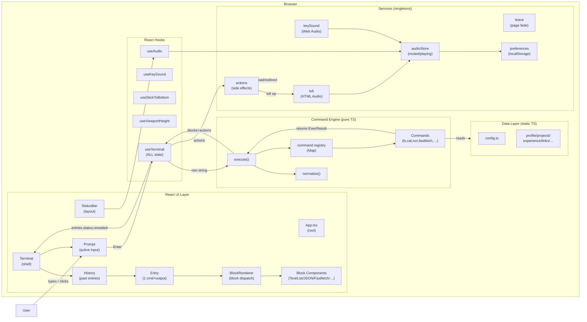

# Chapter 01 — The Big Picture

> **What you'll be able to answer after this chapter:**
> What are the major components and their boundaries? What is the direction of dependencies? What does a typical user interaction look like at a high level? What were the key architectural decisions?

---

## Architecture Diagram



---

## Major Components and Their Boundaries

### 1. Command Engine (`src/engine/`)
**The brain. Completely pure TypeScript. Zero React, zero DOM, zero side effects.**

- Receives a raw string, normalizes it, looks up the command by name, calls `Command.run()`, and returns `{ blocks, actions }`.
- **Does not** touch the DOM, the audio system, localStorage, or React state.
- This separation is the single most important architectural decision: it makes the engine trivially testable with plain `import` + `assert`.

### 2. React UI Layer (`src/components/`)
**The view. Renders what the engine returned.**

- `Terminal` owns the scroll container and the layout; `useTerminal` owns all state.
- `History` renders past entries; `Entry` renders one command+blocks.
- `Prompt` renders the active input line.
- Block components render the block types. They receive `visible` (how many units to show) and `animate` (whether to fade them in).

### 3. Hooks (`src/hooks/`)
**The glue between React and the rest.**

- `useTerminal` is the most important hook: it holds all terminal state (entries, input, status, revealed count), owns the boot sequence, manages the reveal animation timer, and calls the engine.
- All other hooks are focused adapters: `useKeySound` for sound routing, `useStickToBottom` for scroll behavior, `useViewportHeight` for iOS, `useAudio` for the status bar.

### 4. Services (`src/services/`)
**Singletons and side effects. Live outside React.**

- `audioStore` is a tiny hand-rolled observable store (not Zustand, not Context). Components subscribe through `useSyncExternalStore`.
- `keySound` owns the Web Audio API `AudioContext` and the loaded `AudioBuffer`s.
- `lofi` owns the `<audio>` element and its fade timers.
- `actions` dispatches `Action` objects (from the engine) into real browser calls.

### 5. Data Layer (`src/data/`)
**Static content. No logic.**

- `config.ts` holds runtime-configurable settings (URLs, audio pack, lofi track).
- All other files are plain arrays/objects of portfolio content.
- To "personalize" the terminal, you only touch files in this directory.

---

## Dependency Direction

```
Data ←── Engine ←── useTerminal ←── Terminal ←── User
          ↑               ↑
        Services       Services
          ↑               ↑
        Prefs           AudioStore
```

**Rules that are strictly followed:**
- The engine imports from `data/` and `lib/` only.
- The engine **never** imports from `hooks/`, `components/`, or `services/`.
- Services import from `data/` and `lib/` only.
- Hooks import from `engine/`, `services/`, `lib/`, and `data/`.
- Components import from `hooks/`, `engine/` (types), `lib/`, and `data/`.

---

## Key Architectural Decisions

### Decision 1: Pure engine, no React in the command logic
**Why:** Commands can be unit-tested with `execute("ls projects")` and a simple assertion. No mocking, no rendering, no virtual DOM. This is what makes the 12-file test suite so clean and fast.

**Trade-off:** The engine cannot read live state (like whether audio is playing) directly from React. Instead, the terminal passes an `ExecContext` snapshot into `execute()` at call time.

### Decision 2: `ExecResult = { blocks, actions }` — strict separation of output from side effects
**Why:** Side effects like `window.open()` and `window.location.href =` must fire synchronously in a user-gesture handler (click/Enter) or browsers block them as pop-ups. By having the engine return `Action` objects (data, not calls), the terminal can call `performAction()` synchronously before the reveal animation starts.

**Implication:** The `clear` action is the one exception handled differently — it is intercepted by `useTerminal` before reaching `performAction`, because it needs to reset React state rather than call a browser API.

### Decision 3: AudioStore outside React (hand-rolled observable)
**Why:** Audio state (`muted`, `playing`) is read by the command engine (via `getAudioState()`), the key sound service, the lofi service, and the status bar — four separate subsystems. Lifting it into React Context would couple all of them to the render cycle. Instead, it is a module-level singleton with a `subscribe` API; React consumes it via `useSyncExternalStore`.

### Decision 4: Reveal animation via unit counting, not CSS
**Why:** List rows and JSON lines appear one at a time, creating a typewriter effect. The animation is driven by `setTimeout` in `useTerminal`, not by CSS. This allows any key press to "skip" the animation (finish immediately) — a CSS-only approach cannot be interrupted mid-animation cleanly.

---

## How a Typical Request Flows (high-level)

A visitor types `cat experience.txt` and presses Enter:

1. `Prompt` fires `onSubmit("cat experience.txt")`.
2. `useTerminal.submit()` calls `execute("cat experience.txt", { audio: getAudioState() })`.
3. `execute` normalizes → splits → finds `catCommand` in the registry → calls `catCommand.run(["experience.txt"])`.
4. `catCommand` returns `{ blocks: [text…, text…, text…], actions: [] }`.
5. `useTerminal` appends an `Entry` to `entries`, counts the total units (3 text blocks = 3 units), sets `revealed = 0` and `status = "running"`.
6. A `setTimeout` chain increments `revealed` every 34 ms until all 3 are shown.
7. `History` → `Entry` renders the blocks. For each block, `visible = max(0, min(units, revealed - offset))`. Blocks with `visible > 0` render via `BlockRenderer` → `TextBlock` → `Reveal` (fade-in animation).
8. After the last unit: `status = "idle"`, `revealed = Infinity`, `Prompt` re-appears.

---

**→ Check your understanding:** [quizzes/01-big-picture-quiz.md](quizzes/01-big-picture-quiz.md)
