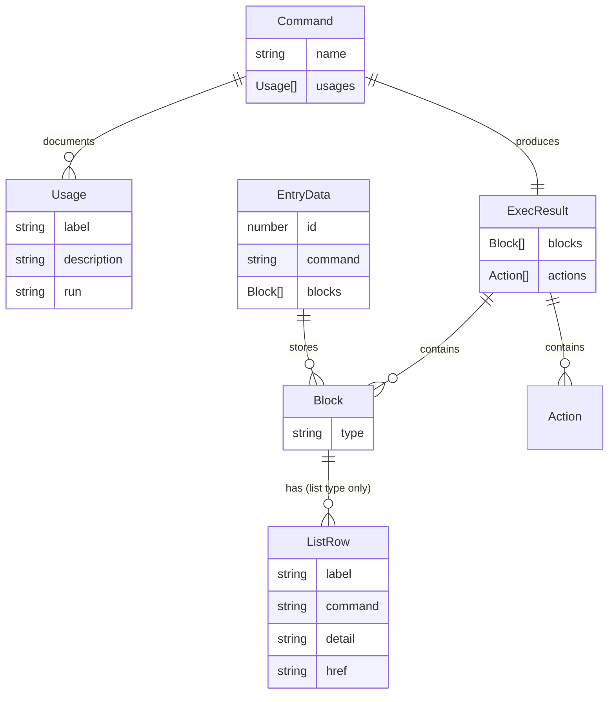

# Chapter 02 — Core Concepts & Domain Model

> **What you'll be able to answer after this chapter:**
> What is a Block? What is an Action? What is a Command? What is an Entry? What is a Unit? How do these concepts relate? What are the invariants the system must preserve?

---

## The Vocabulary

This chapter defines every core concept. If a term is used elsewhere in the book, it is defined here.

---

### Block

**Definition:** The atomic unit of rendered output from a command.

Every command returns zero or more blocks. The UI renders blocks in order, one after another, in a vertical stack. There are exactly **six block types**:

```ts
// src/engine/types.ts:19-31
export type Block =
  | { type: "text"; text: string; tone?: Tone; measure?: boolean }
  | { type: "error"; text: string }
  | { type: "list"; rows: ListRow[] }
  | { type: "json"; lines: string[] }
  | { type: "spacer" }
  | { type: "fastfetch"; logo: { src: string; alt: string }; heading: string; subheading: string; rows: { label: string; value: string }[] };
```

| Block type | Rendered as | Units | Notes |
|-----------|-------------|-------|-------|
| `text` | Plain paragraph | 1 | `tone` sets color; `measure` caps width to 80ch |
| `error` | Red error line | 1 | Always followed by a hint line (added by `fail()`) |
| `list` | Two-column clickable table | N (one per row) | Label can be a button that runs a command |
| `json` | Syntax-colored JSON | N (one per line) | Lines are pre-split by `JSON.stringify(...).split("\n")` |
| `fastfetch` | Profile card with logo | 1 | Mirroring the real `fastfetch` Linux tool |
| `spacer` | Empty gap | 1 | Used between experience entries |

**Invariant:** A block is a plain data object. It contains no functions, no React elements, no DOM references.

---

### Unit

**Definition:** The smallest piece that is revealed individually during the reveal animation.

- A `text`, `error`, `fastfetch`, or `spacer` block = **1 unit**.
- A `list` block = **N units** (one per row).
- A `json` block = **N units** (one per line).

The function `unitCount(block)` computes this (`src/engine/blocks.ts:7-16`). `unitTotal(blocks)` sums all blocks in a result.

**Why:** This allows `ls projects` with 3 projects to reveal 3 rows, one at a time, rather than appearing all at once.

---

### Action

**Definition:** A side effect instruction returned alongside blocks by the engine.

```ts
// src/engine/types.ts:37-42
export type Action =
  | { type: "clear" }
  | { type: "open"; url: string }
  | { type: "download"; href: string; filename: string }
  | { type: "redirect"; url: string; delayMs?: number }
  | { type: "lofi"; op: "play" | "stop" };
```

**Critical invariant:** Actions are data, not function calls. The engine returns them; the terminal (`useTerminal`) decides when and whether to execute them. This matters because `window.open()` can only succeed from a synchronous user-gesture handler — by returning the action as data, the terminal can call `performAction()` in the same handler tick as the Enter key press.

**`clear` is special:** `useTerminal` intercepts the `clear` action and resets React state directly, before calling `performAction`. No other action needs special-casing at the terminal level.

---

### ExecContext

**Definition:** A snapshot of ambient world state injected into the engine at execution time.

```ts
// src/engine/types.ts:45-47
export interface ExecContext {
  audio: { playing: boolean; muted: boolean };
}
```

**Why it exists:** The engine is pure and stateless. But some commands need to know ambient state (e.g., `play` needs to know if music is already playing). Rather than coupling the engine to `audioStore`, the terminal reads the state at call time and passes it in.

---

### ExecResult

**Definition:** The combined return value of a command.

```ts
// src/engine/types.ts:49-52
export interface ExecResult {
  blocks: Block[];
  actions: Action[];
}
```

Every command run produces exactly one `ExecResult`. If the command is invalid (wrong number of arguments), it returns `null` instead, which causes `execute()` to fall through to the "unknown command" error.

---

### Command

**Definition:** A named, self-describing unit that converts `(args, context)` into `ExecResult | null`.

```ts
// src/engine/types.ts:62-67
export interface Command {
  name: string;
  usages: Usage[];
  run(args: string[], ctx: ExecContext): ExecResult | null;
}
```

**Key contracts:**
- `run()` returns `null` when the provided arguments are not valid for this command (e.g., `play` with any arguments → `null`, which causes the unknown-command error). This is different from returning an error block — `null` means "I don't handle this invocation at all."
- `usages` drives the help list generated by `rosh -h`. It must stay in sync with what `run()` actually does — but since `rosh.ts` generates help from this array directly, drift is structurally prevented.

---

### Usage

**Definition:** One documented way to call a command. Drives the help list.

```ts
// src/engine/types.ts:54-60
export interface Usage {
  label: string;
  description: string;
  run?: string;    // Omit if the usage has a placeholder (e.g., "cat <project>.txt")
}
```

If `run` is provided, the help list renders the label as a clickable button. If absent (because the label contains a placeholder like `<project>`), it is shown as non-clickable static text.

---

### Entry

**Definition:** One command run and its output, stored in React state.

```ts
// src/hooks/useTerminal.ts:17-21
export interface EntryData {
  id: number;
  command: string;
  blocks: Block[];
}
```

`id` is a monotonically incrementing number used as the React key. `entries` in `useTerminal` is an append-only array: commands are never mutated or removed except by `clear`.

---

### Status

**Definition:** The current mode of the terminal.

```ts
// src/hooks/useTerminal.ts:15
export type Status = "idle" | "typing" | "running";
```

| Status | Meaning | Input locked? |
|--------|---------|---------------|
| `idle` | Waiting for the visitor to type | No |
| `typing` | A scripted command is being typed character-by-character | Yes |
| `running` | Output is being revealed (unit by unit) | Yes |

**Invariant:** The prompt is only visible when `status !== "running"`. Input changes are ignored when `status !== "idle"`.

---

### Tone

**Definition:** A color variant for `text` blocks.

```ts
// src/engine/types.ts:6
export type Tone = "normal" | "muted" | "strong";
```

| Tone | Color |
|------|-------|
| `normal` | `text-neutral-200` (default) |
| `muted` | `text-neutral-400` (secondary/hint text) |
| `strong` | `text-neutral-50` (headings like role + company) |

---

### ListRow

**Definition:** One row in a list block.

```ts
// src/engine/types.ts:8-17
export interface ListRow {
  label: string;
  command?: string;  // if set: label is a button that runs this command
  detail?: string;
  href?: string;     // if set: detail is an external link
}
```

Four combinations are possible:
1. `label` only — static text.
2. `label + command` — label is a button; clicking it types and runs `command`.
3. `label + detail` — two-column: label on left, muted detail on right.
4. `label + detail + href` — detail is an external link.

---

## Domain Concepts Map



---

## Invariants the System Must Preserve

1. **Engine purity:** `execute()` and all `Command.run()` implementations must not read or write any module-level state. They receive their context via `ExecContext`.

2. **Action timing:** `performAction()` must be called synchronously from the Enter/click handler (before any `await` or `setState`). Violation: `window.open()` is blocked as a pop-up.

3. **Append-only entries:** `entries` only grows. `clear` replaces it with `[]` but never mutates individual entries. Finished entries are memoised (`Entry` is `memo`-wrapped) and must never re-render.

4. **Unit counting consistency:** `unitCount(block)` must return a number ≥ 1 for every block, and must stay in sync with how the block component renders its content. If `JsonBlock` slices `lines.slice(0, visible)`, then `unitCount` must return `lines.length`.

5. **Null = no match:** A command returns `null` only when it cannot handle the given arguments *at all*. It must not return `null` for semantic errors (wrong file name, etc.) — those get an error block.

---

**→ Check your understanding:** [quizzes/02-core-concepts-quiz.md](quizzes/02-core-concepts-quiz.md)
