# Chapter 04 — Terminal UI

> **What you'll be able to answer after this chapter:**
> How does useTerminal manage all state? How does the reveal animation work? How does the prompt work (visible vs. hidden input)? How does auto-scroll work? How does the boot sequence work? What is the click-to-run flow?

---

## Component Tree

```mermaid
flowchart TD
    App --> StatusBar
    App --> Terminal
    Terminal --> History
    Terminal --> Prompt
    History --> Entry1["Entry (id=1, revealed=∞)"]
    History --> Entry2["Entry (id=2, revealed=∞)"]
    History --> EntryN["Entry (id=N, revealed=count)"]
    EntryN --> CommandLine
    EntryN --> BlockRenderer1["BlockRenderer(block[0])"]
    EntryN --> BlockRenderer2["BlockRenderer(block[1])"]
    Prompt --> PromptLabel
    Prompt --> Cursor
    Prompt --> HiddenInput["<input> (invisible)"]
```



---

## useTerminal — The State Machine

**File:** `src/hooks/useTerminal.ts`

This is the most important hook in the codebase. It owns all terminal state and all transitions between states.

### State

```ts
const [entries, setEntries]   = useState<EntryData[]>([]);   // all past commands + output
const [input, setInput]       = useState("");                 // current prompt text
const [status, setStatusState] = useState<Status>("idle");   // idle | typing | running
const [revealed, setRevealed] = useState<number>(Infinity);  // how many units of last entry are visible
```

`status` is also mirrored in a `useRef` (called `statusRef`) so the value can be read synchronously inside callbacks without capturing stale closures.

Similarly `inputRef` mirrors `input` and is read during the boot-sequence check.

### Timing Constants

```ts
const BOOT_COMMAND = "rosh --help";
const BOOT_DELAY = 450;         // ms before auto-typing starts after page load
const FIRST_UNIT_DELAY = 70;   // ms before first unit reveals
const UNIT_DELAY = 34;         // ms between subsequent units (~29fps)
const TYPE_START_DELAY = 140;  // ms before scripted typing starts
const PRE_SUBMIT_PAUSE = 260;  // ms of "finished typing" pause before submit
```

These are magic numbers tuned for "feels like a real terminal" pacing. They are not configurable at runtime.

---

### submit(raw) — The Core Flow

Called when the visitor presses Enter (or a command is clicked and has been typed).

```ts
const submit = useCallback((raw: string) => {
  if (statusRef.current === "running") return;  // locked during reveal
  clearTimer();
  skipRef.current = null;
  setInput("");

  const result = execute(raw, { audio: getAudioState() });  // → ExecResult

  let cleared = false;
  for (const action of result.actions) {
    if (action.type === "clear") cleared = true;
    else performAction(action);  // synchronously, while still a user gesture!
  }

  if (cleared) {
    entryCountRef.current = 0;
    setEntries([]);
    setRevealed(Infinity);
    setStatus("idle");
    return;
  }

  const entry: EntryData = { id: ++entryIdRef.current, command: raw, blocks: result.blocks };
  entryCountRef.current += 1;
  setEntries((prev) => [...prev, entry]);

  const total = unitTotal(entry.blocks);
  if (total === 0 || reducedRef.current) {
    setRevealed(Infinity);
    setStatus("idle");
    return;
  }

  setRevealed(0);
  setStatus("running");

  let shown = 0;
  const finish = () => { clearTimer(); skipRef.current = null; setRevealed(Infinity); setStatus("idle"); };
  skipRef.current = finish;

  const tick = () => {
    shown += 1;
    if (shown >= total) { finish(); return; }
    setRevealed(shown);
    timerRef.current = window.setTimeout(tick, UNIT_DELAY);
  };
  timerRef.current = window.setTimeout(tick, FIRST_UNIT_DELAY);
}, [clearTimer, setStatus]);
```

**Key design decisions:**
- `performAction()` is called in a `for` loop *before* any `setState` calls. This ensures it fires in the same microtask as the user's Enter press, so `window.open()` is not blocked.
- The `clear` action is detected in this same loop and short-circuits everything: entries reset, no animation.
- If `total === 0` (command produced no blocks, e.g., `clear` already handled) or `reducedRef.current` (user prefers reduced motion), skip animation entirely.
- The reveal timer uses a `shown` closure counter (not React state) to avoid extra re-renders while counting.

---

### runCommand(text) — Scripted Typing

Called when a list item button is clicked, or during the boot sequence.

```ts
const runCommand = useCallback((text: string) => {
  if (statusRef.current !== "idle") return;  // only from idle state
  setStatus("typing");
  setInput("");

  if (reducedRef.current) {
    setInput(text);
    timerRef.current = window.setTimeout(finish, 180);
    return;
  }

  let typed = 0;
  const typeNext = () => {
    typed += 1;
    setInput(text.slice(0, typed));
    if (typed >= text.length) {
      timerRef.current = window.setTimeout(finish, PRE_SUBMIT_PAUSE);  // pause before submit
      return;
    }
    timerRef.current = window.setTimeout(typeNext, rand(28, 62));  // random per-char delay
  };
  timerRef.current = window.setTimeout(typeNext, TYPE_START_DELAY);
}, [clearTimer, setStatus, submit]);
```

**Human typing simulation:** Each character is revealed after a random 28–62ms delay (from `rand()` in `lib/utils.ts`). After the last character, there's a 260ms pause ("thinking") before `submit()` is called. This makes automated runs feel like real typing.

**Reduced motion:** If the user has `prefers-reduced-motion: reduce`, the full text appears immediately and `submit()` fires after 180ms (no character-by-character typing).

---

### skip() — Skip Animation

```ts
const skip = useCallback(() => {
  skipRef.current?.();
}, []);
```

`skipRef.current` always points to the current "finish immediately" function, whether in `typing` or `running` state. Any key press while busy calls `skip()` — this is the terminal equivalent of pressing any key to skip a loading animation.

---

### Boot Sequence

```ts
useEffect(() => {
  if (entryCountRef.current > 0) return; // hot reload: don't re-run
  let cancelled = false;

  const start = async () => {
    try { await document.fonts?.ready; } catch { /* go ahead if fonts API unavailable */ }
    if (cancelled) return;
    timerRef.current = window.setTimeout(() => {
      const userAlreadyActed = entryCountRef.current > 0 || inputRef.current !== "";
      if (!cancelled && !userAlreadyActed) runCommand(BOOT_COMMAND);
    }, BOOT_DELAY);
  };
  void start();

  return () => { cancelled = true; reset(); };
}, [runCommand, reset]);
```

**`document.fonts?.ready`:** The boot sequence waits for fonts to load before typing starts. Without this, the terminal could show the "wrong" font momentarily before Geist Mono loads and causes a layout shift during typing.

**React Strict Mode double-effect:** The cleanup function sets `cancelled = true`, so if `useEffect` fires twice (Strict Mode), the first run is cancelled before it can run `runCommand`. The second run finds `entryCountRef.current = 0` and starts fresh.

**User-preemption check:** If the visitor types or clicks before the boot delay, `userAlreadyActed` is true and the auto-run is skipped. This prevents the annoying situation where the visitor starts typing and the boot sequence overwrites them.

---

## Terminal.tsx — The Shell

```tsx
export default function Terminal() {
  const { entries, input, setInput, status, revealed, submit, runCommand, skip } = useTerminal();

  const scrollRef = useRef<HTMLElement>(null);
  const contentRef = useRef<HTMLDivElement>(null);
  const inputRef = useRef<HTMLInputElement>(null);
  const { pin } = useStickToBottom(scrollRef, contentRef);

  const handleSubmit = useCallback((raw: string) => { pin(); submit(raw); }, [pin, submit]);
  const handleRun    = useCallback((command: string) => { pin(); runCommand(command); }, [pin, runCommand]);

  useEffect(() => {
    if (status === "idle") inputRef.current?.focus({ preventScroll: true });
  }, [status]);

  function handleClick() {
    if (status !== "idle") { skip(); return; }
    if (window.getSelection()?.toString()) return;
    inputRef.current?.focus({ preventScroll: true });
  }

  return (
    <main ref={scrollRef} onClick={handleClick} className="min-h-0 flex-1 overflow-y-auto pb-[env(safe-area-inset-bottom)]">
      <Container className="py-4 text-sm leading-relaxed sm:text-[15px] sm:leading-relaxed">
        <div ref={contentRef} role="log" aria-live="polite" className="flex flex-col gap-3 pb-6">
          <History entries={entries} revealed={revealed} onRun={handleRun} />
          <Prompt input={input} status={status} inputRef={inputRef} onInputChange={setInput} onSubmit={handleSubmit} onSkip={skip} />
        </div>
      </Container>
    </main>
  );
}
```

**`role="log" aria-live="polite"`:** The content div is an ARIA live region. Screen readers announce new entries as they appear without interrupting what the user is reading.

**`pin()` before submit/run:** Both `handleSubmit` and `handleRun` call `pin()` first. This re-enables scroll-to-bottom pinning, so the new output scrolls into view even if the user had scrolled up.

**Click anywhere = focus input:** Clicking the terminal (not a selection, not while busy) focuses the hidden input. This is the "any click = terminal focused" behavior of real terminals.

**Click while busy = skip:** If status is `"typing"` or `"running"`, a click calls `skip()` instead — equivalent to "press any key" to finish the animation.

---

## Prompt.tsx — The Invisible Input Trick

The prompt uses a dual-layer technique common in custom terminal UIs:

**Layer 1 (visual):** A `<div>` renders the visible text using our own layout: `<PromptLabel />` + `{before}` + `<Cursor char={char} />` + `{after}`. This layer is `aria-hidden="true"`.

**Layer 2 (real input):** A true `<input>` sits absolutely positioned over the entire prompt area. It is visually invisible (`opacity-0`, `text-transparent`, `caret-transparent`) but receives all keyboard events and is what screen readers interact with.

```tsx
// src/components/terminal/Prompt.tsx:36-39
const position = status === "typing" ? input.length : Math.min(caret, input.length);
const before = input.slice(0, position);
const char = input[position] ?? " ";   // space if at end of string
const after = input.slice(position + 1);
```

**Why this works:** The `caret` state tracks the real `<input>`'s `selectionStart`. The visual layer always shows the cursor at the exact same position as the hidden input's caret. When `status === "typing"`, the position is always `input.length` (end) because scripted typing always appends.

**Cursor states:**
- `"blink"`: focused + idle. CSS animation `cursor-blink` at 1.05s, using `steps(1, end)`.
- `"solid"`: scripted typing is in progress.
- `"hollow"`: page is not focused (outline-only cursor, like xterm).

**`handleMouseDown`:**
```tsx
function handleMouseDown(event: MouseEvent<HTMLInputElement>) {
  event.preventDefault();
  const field = event.currentTarget;
  field.focus({ preventScroll: true });
  field.setSelectionRange(field.value.length, field.value.length);
  setCaret(field.value.length);
}
```
Forces the caret to always snap to the end on click. This prevents the hidden input's selection from disagreeing with the visual cursor — if a user click set the caret in the middle, the visual cursor would be in the wrong position.

---

## History.tsx and Entry.tsx

**History** is thin: maps `entries` to `Entry` components, passing `visibleUnits = revealed` only to the last entry (all others get `Infinity`).

**Entry** is memoised (`memo`):

```tsx
const Entry = memo(function Entry({ entry, visibleUnits, onRun }) {
  const animate = Number.isFinite(visibleUnits);
  let offset = 0;

  return (
    <div className="flex flex-col gap-1">
      <CommandLine command={entry.command} />
      {entry.blocks.map((block, index) => {
        const units = unitCount(block);
        const visible = Math.max(0, Math.min(units, visibleUnits - offset));
        offset += units;
        if (visible === 0) return null;
        return <BlockRenderer key={index} block={block} visible={visible} animate={animate} onRun={onRun} />;
      })}
    </div>
  );
});
```

**`offset` accumulates:** For a result with 3 blocks of 2 units each, and `visibleUnits = 3`:
- Block 0: `visible = min(2, 3-0) = 2` (fully shown). `offset = 2`.
- Block 1: `visible = min(2, 3-2) = 1` (half shown). `offset = 4`.
- Block 2: `visible = min(2, 3-4) = 0` (hidden, returns null). `offset = 6`.

This allows the reveal to "flow across" block boundaries smoothly.

**`animate = Number.isFinite(visibleUnits)`:** Once `visibleUnits` is `Infinity` (reveal finished), entries pass `animate=false` to their blocks. The `Reveal` wrapper skips the fade animation for already-visible content, which prevents unnecessary re-animations on re-renders.

**Memoisation:** Finished entries never re-render while later output appears. The `memo` wrapper ensures this: `visibleUnits` is always `Infinity` for all but the last entry, so their props never change.

---

## useStickToBottom

**File:** `src/hooks/useStickToBottom.ts`

```ts
const NEAR_BOTTOM_PX = 48;

export function useStickToBottom(scrollRef, contentRef) {
  const stick = useRef(true);

  const toBottom = () => { scrollRef.current.scrollTop = scrollRef.current.scrollHeight; };

  useEffect(() => {
    const follow = () => { if (stick.current) toBottom(); };
    const onScroll = () => {
      stick.current = scroller.scrollHeight - scroller.scrollTop - scroller.clientHeight <= NEAR_BOTTOM_PX;
    };

    const observer = new ResizeObserver(follow);
    observer.observe(content);
    observer.observe(scroller);
    scroller.addEventListener("scroll", onScroll, { passive: true });
    follow();
    return () => { observer.disconnect(); scroller.removeEventListener("scroll", onScroll); };
  }, [scrollRef, contentRef, toBottom]);

  const pin = () => { stick.current = true; toBottom(); };
  return { pin };
}
```

**How it works:**
- `ResizeObserver` watches both the content and the scroll container. When either resizes (new output added, viewport changes, keyboard opens), `follow()` fires. If `stick` is true, it scrolls to the bottom.
- `onScroll` flips `stick` to false when the user scrolls up more than 48px from the bottom. This is the "leave them alone while reading" behavior.
- `pin()` re-enables `stick` and immediately scrolls to bottom. Called before every submit/runCommand.

---

**→ Check your understanding:** [quizzes/04-terminal-ui-quiz.md](quizzes/04-terminal-ui-quiz.md)
