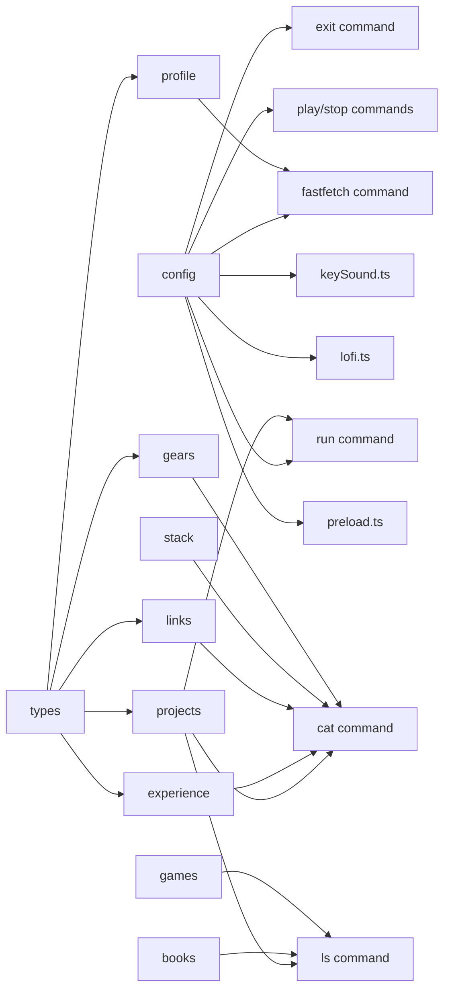

# Chapter 07 — Data Layer

> **What you'll be able to answer after this chapter:**
> What data structures hold all portfolio content? What are the TypeScript types for each? Where is runtime config stored and how is it consumed? What does "placeholder content" mean and where do you change it?

---

## Overview

All portfolio content and runtime settings live in `src/data/`. This directory is the **only place you should edit** when personalizing the terminal.

| File | Exported value | Type | Used by |
|------|---------------|------|---------|
| `config.ts` | `config` | inline object | all commands, lofi, keySound, exit, run, fastfetch |
| `profile.ts` | `profile` | `Profile` | fastfetch command |
| `projects.ts` | `projects` | `Project[]` | cat, ls, run commands |
| `experience.ts` | `experience` | `ExperienceEntry[]` | cat command |
| `links.ts` | `links` | `LinkEntry[]` | cat command |
| `stack.ts` | `stack` | plain object | cat command |
| `books.ts` | `books` | `TitledEntry[]` | ls command |
| `games.ts` | `games` | `TitledEntry[]` | ls command |
| `gears.ts` | `gears` | `GearGroup[]` | cat command |
| `types.ts` | (types only) | — | all data files |

---

## types.ts — Data Interfaces

```ts
// src/data/types.ts
export interface Project {
  slug: string;       // lowercase kebab-case. Used in "cat <slug>.txt" and "run <slug>"
  name: string;
  tagline: string;    // one line; shown in "ls projects"
  description: string; // multi-line; shown by "cat <slug>.txt"
  url: string;        // where "run <slug>" opens
}

export interface ExperienceEntry {
  role: string;
  company: string;
  period: string;
  summary: string;
}

export interface Profile {
  name: string;
  dateOfBirth: string;  // "YYYY-MM-DD" — age is computed from this
  location: string;
  summary: string;
  extras: { label: string; value: string }[];  // extra fastfetch rows between Location and About
}

export interface LinkEntry {
  label: string;   // short identifier: "github", "mail"
  display: string; // text shown on screen: "github.com/handle"
  url: string;     // actual href
}

export interface TitledEntry {
  title: string;
  note?: string;
}

export interface GearGroup {
  category: string;
  items: string[];
}
```

---

## config.ts — Runtime Configuration

```ts
// src/data/config.ts
export const config = {
  mainSiteUrl: (import.meta.env.VITE_MAIN_SITE_URL as string | undefined) || "https://example.com",
  resume: { href: "/resume.pdf", filename: "resume.pdf" },
  logo: { src: "/logo.svg", alt: "Rosh logo" },

  keyboard: {
    basePath: "/audio/keys",
    pack: "bluealps",          // which keyboard sound pack to use
    genericVariants: 5,        // how many GENERIC_R0..R4.mp3 files exist
    playRelease: false,        // true = also play key-up sounds
    volume: 0.6,
  },

  lofi: {
    src: "/audio/lofi/honeyjam.mp3",
    title: "Honey Jam",
    artist: "Massobeats",
    url: undefined as string | undefined,  // optional artist/track link
    volume: 0.35,
  },
};
```

**`VITE_MAIN_SITE_URL` from env:** This is the only runtime-variable setting. It is injected at build time by Vite using the `import.meta.env` API. If the env var is not set (e.g., in development), the fallback is `"https://example.com"`.

**All other settings are compile-time constants.** Changing `keyboard.pack` requires a redeploy (but not an env var — it's in source code).

**`logo` shape** must match the `fastfetch` block type: `{ src: string; alt: string }`. The `src` points to a file in `/public/` (e.g., `/logo.svg`). `preload.ts` preloads it at startup.

---

## projects.ts — The Project List

```ts
// src/data/projects.ts (placeholder)
export const projects: Project[] = [
  {
    slug: "project-one",
    name: "Project One",
    tagline: "one-line summary of the first project",
    description: "A short paragraph about…\nA second line…",
    url: "https://example.com/project-one",
  },
  // …
];
```

**Slug conventions:**
- Must be lowercase kebab-case (the engine lowercases all input, so `cat Project-One.txt` would be `cat project-one.txt` after normalization — the slug must match).
- Must be unique (the `cat` command uses `Array.find` by slug; if two slugs match, the first wins).
- Cannot be `"resume"` (reserved by the `run` command).

**Command integration:**
- `ls projects` → maps to `{ label: slug, command: "cat {slug}.txt", detail: tagline }`.
- `cat {slug}.txt` → looks up by slug, displays name/tagline/description/run-row.
- `run {slug}` → looks up by slug, opens `url`.

---

## profile.ts — Fastfetch Data

```ts
// src/data/profile.ts (placeholder)
export const profile: Profile = {
  name: "Rosh",
  dateOfBirth: "2000-01-01",    // YYYY-MM-DD — age computed at run time
  location: "City, Country",
  summary: "A short two-line summary.",
  extras: [{ label: "Role", value: "Frontend developer" }],
};
```

**`extras` is flexible:** Add as many extra rows as you want between Location and About. Common uses: `{ label: "Status", value: "Open to work" }`, `{ label: "Languages", value: "English, Hindi" }`.

---

## stack.ts — JSON Output

```ts
// src/data/stack.ts (placeholder)
export const stack = {
  languages: ["TypeScript", "JavaScript"],
  frontend: ["React", "Vite", "Tailwind CSS", "Motion"],
  runtime: ["Bun"],
  tools: ["Git", "Figma"],
};
```

This is a plain object. `cat stack.json` runs `JSON.stringify(stack, null, 2).split("\n")` and passes the lines to a `json` block. The structure can have any keys and any array values — the JSON block will render whatever shape you provide.

---

## links.ts — Contact Links

```ts
// src/data/links.ts (placeholder)
export const links: LinkEntry[] = [
  { label: "mail",      display: "you@example.com",          url: "mailto:you@example.com" },
  { label: "instagram", display: "instagram.com/your-handle", url: "https://instagram.com/your-handle" },
  { label: "github",    display: "github.com/your-handle",    url: "https://github.com/your-handle" },
  { label: "linkedin",  display: "linkedin.com/in/your-handle", url: "https://linkedin.com/in/your-handle" },
  { label: "behance",   display: "behance.net/your-handle",   url: "https://behance.net/your-handle" },
];
```

Rendered by `cat connect.txt` as a list block. All rows have `href` set, so `detail` becomes an external link.

---

## books.ts, games.ts, gears.ts

These are simple data arrays with no logic. Each is rendered by `ls books`, `ls games`, or `cat gears.txt`:

```ts
// books.ts — TitledEntry[]
export const books: TitledEntry[] = [
  { title: "Book Title", note: "Optional short note" },
];

// games.ts — TitledEntry[]
export const games: TitledEntry[] = [
  { title: "Game Title", note: "Optional note" },
];

// gears.ts — GearGroup[]
export const gears: GearGroup[] = [
  { category: "Computer", items: ["MacBook Pro", "External Monitor"] },
  { category: "Input",    items: ["Mechanical Keyboard", "Mouse"] },
];
```

`gears` maps categories to label and comma-joined items as the detail column.

---

## Data Flow Diagram



---

**→ Check your understanding:** [quizzes/07-data-layer-quiz.md](quizzes/07-data-layer-quiz.md)
