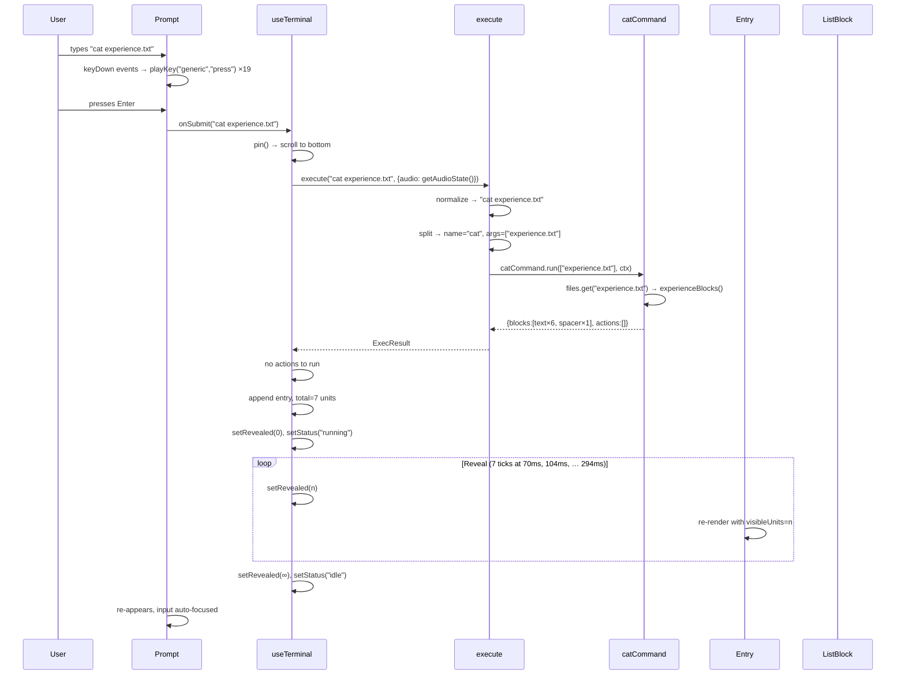
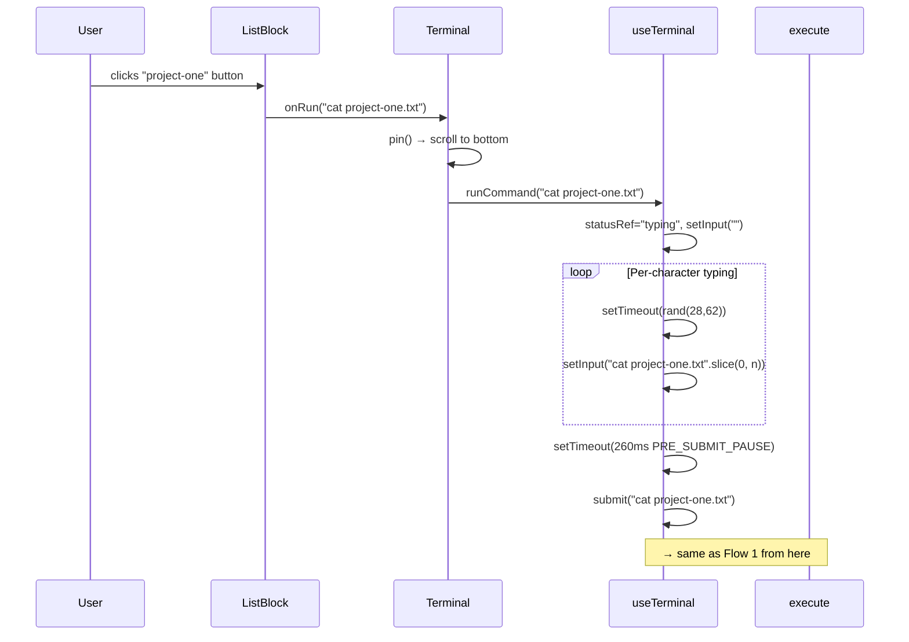
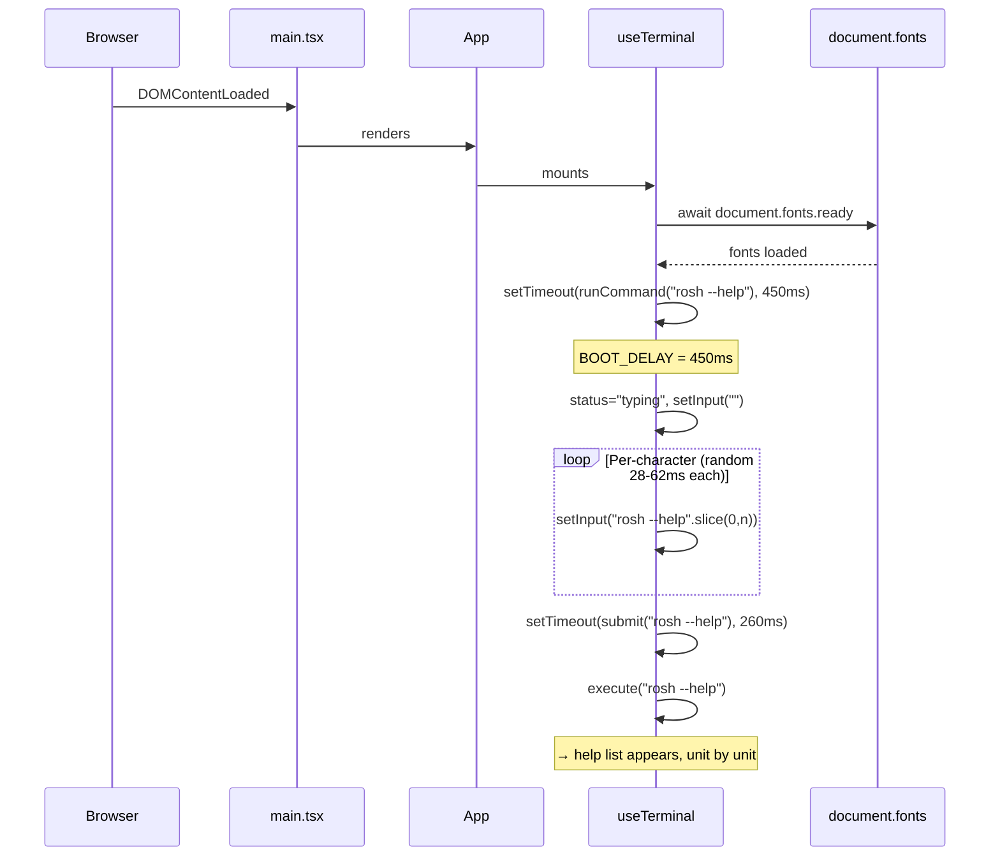

# Chapter 11 — Key Flows

> **What you'll be able to answer after this chapter:**
> What is the exact step-by-step path for every important operation? What are the concrete inputs and outputs at each step?

---

## Flow 1: Visitor Types a Command (Happy Path)

**Scenario:** Visitor types `cat experience.txt` and presses Enter.



---

## Flow 2: Click to Run a Command

**Scenario:** Visitor sees `ls projects` output and clicks the `project-one` label.



---

## Flow 3: run project-one (opens a tab)

**Scenario:** Visitor types `run project-one` and presses Enter.

1. `Prompt.handleKeyDown("Enter")` → `onSubmit("run project-one")`.
2. `useTerminal.submit("run project-one")`.
3. `execute("run project-one")` → normalizes, splits → `runCommand.run(["project-one"])`.
4. `runCommand` finds `project-one` in `projects`. Returns:
   ```ts
   {
     blocks: [{ type: "text", tone: "muted", text: "opening Project One in a new tab..." }],
     actions: [{ type: "open", url: "https://example.com/project-one" }]
   }
   ```
5. Back in `useTerminal.submit()`:
   ```ts
   for (const action of result.actions) {
     if (action.type === "clear") cleared = true;
     else performAction(action);  // ← called HERE, synchronously in user gesture
   }
   ```
6. `performAction({ type: "open", url: "…" })` → `window.open(url, "_blank", "noopener,noreferrer")`. This fires while still in the Enter key handler → browser allows it (no pop-up block).
7. Entry appended with 1 text unit. Reveals in 70ms. Status returns to idle.

**Critical timing:** If `performAction()` were called after `setEntries()` or after any `await`, the `window.open()` call would be in a new task and browsers would block it as a pop-up. The synchronous-before-setState ordering is essential.

---

## Flow 4: play (lofi music)

**Scenario:** Visitor types `play` and presses Enter.

1. `execute("play", { audio: { playing: false, muted: false } })`.
2. `playCommand.run([], { audio: { playing: false, muted: false } })`.
3. `ctx.audio.playing === false`, `ctx.audio.muted === false`.
4. Returns:
   ```ts
   { blocks: [{ type: "text", text: "now playing: Honey Jam by Massobeats" }], actions: [{ type: "lofi", op: "play" }] }
   ```
5. `performAction({ type: "lofi", op: "play" })` → `playLofi()`.
6. `playLofi()`:
   - `getAudioState().muted` is false, so no unmute needed.
   - `el.src = config.lofi.src` (swap in the real MP3).
   - `setPlaying(true)` → notifies `audioStore` listeners.
   - `el.play()` (async, might fail).
   - `fadeTo(0.35, 1200)` → starts 1.2s fade-in.
7. StatusBar re-renders via `useAudio` → `useSyncExternalStore`: shows "now playing: Honey Jam by Massobeats".

---

## Flow 5: exit (page leave)

**Scenario:** Visitor types `exit` and presses Enter.

1. `execute("exit")` → `exitCommand.run([])`.
2. Returns:
   ```ts
   {
     blocks: [{ type: "text", tone: "muted", text: "redirecting to https://example.com..." }],
     actions: [{ type: "redirect", url: "https://example.com", delayMs: 900 }]
   }
   ```
3. `performAction({ type: "redirect", url, delayMs: 900 })`.
4. `prefersReducedMotion()` returns false (assume normal motion).
5. `setTimeout(beginLeaving, Math.max(0, 900 - 550))` = `setTimeout(beginLeaving, 350)`.
6. `setTimeout(() => navigate(url), 900)`.
7. At t=350ms: `beginLeaving()` → `document.documentElement.dataset.leaving = "true"` → CSS `#root { opacity: 0; transition: 0.5s ease-in }` starts.
8. At t=900ms (= t=350 + 550): fade is complete, `navigate("https://example.com")` fires.

---

## Flow 6: Boot Sequence

**Scenario:** Page first loads.



**User pre-emption:** If the user types anything or clicks before the boot timer fires, `userAlreadyActed = true` and `runCommand` is not called. The user's own action takes precedence.

---

## Flow 7: clear

**Scenario:** Visitor types `clear` and presses Enter.

1. `execute("clear")` → `clearCommand.run([])`.
2. Returns `{ blocks: [], actions: [{ type: "clear" }] }`.
3. In `useTerminal.submit()`:
   ```ts
   for (const action of result.actions) {
     if (action.type === "clear") cleared = true;  // ← flagged
     else performAction(action);
   }
   if (cleared) {
     entryCountRef.current = 0;
     setEntries([]);           // ← all history wiped
     setRevealed(Infinity);
     setStatus("idle");
     return;                   // ← early return, no new entry added
   }
   ```
4. No entry is appended (not even the `clear` command itself). The terminal is blank.

**Why no entry for `clear`:** Unlike every other command, `clear` should not add itself to the history. The early return before `setEntries((prev) => [...prev, entry])` ensures this.

---

## Flow 8: Unknown Command

**Scenario:** Visitor types `foo bar baz` and presses Enter.

1. `normalize("foo bar baz")` → `"foo bar baz"`.
2. `registry.get("foo")` → `undefined`.
3. `undefined?.run(args, ctx)` → `undefined`.
4. `result ?? unknown("foo bar baz")`.
5. `unknown()`:
   ```ts
   function unknown(raw: string): ExecResult {
     const typed = raw.trim().replace(/\s+/g, " ");
     const shown = typed.length > 60 ? `${typed.slice(0, 60)}...` : typed;
     return {
       blocks: [
         { type: "error", text: `command not found: ${shown}` },
         { type: "text", tone: "muted", text: "use rosh -h or rosh --help to view commands" },
       ],
       actions: [],
     };
   }
   ```
6. Entry added with 2 blocks (2 units). Reveals in ~70ms, ~104ms.

---

## Flow 9: Key Sound While Typing (Physical Keyboard)

**Scenario:** User presses the `a` key.

1. `keydown` event fires on the hidden `<input>` in `Prompt`.
2. `Prompt.handleKeyDown(event)`.
3. `sound.keyDown(event)` → `useKeySound.keyDown`.
4. `isVirtualKey("a", 65)` → false.
5. `virtual.current = false`.
6. `classifyKey("a")` → `"generic"`.
7. `playKey("generic", "press")`.
8. In `keySound.ts`:
   - `getAudioState().muted` → false.
   - `performance.now() - lastPlayed["press"]` > 25ms → pass.
   - `pick("generic", "press")` → `banks.press.generic[2]` (random, not same as last).
   - `getContext()` → existing `AudioContext`.
   - Create `BufferSource`, connect to `GainNode`, connect to destination.
   - `source.playbackRate.value = 1 + (random - 0.5) * 0.06` (e.g., 1.02).
   - `gain.gain.value = 0.6 * (0.92 + random * 0.16)` (e.g., 0.55).
   - `source.start()`.
9. Sound plays within ~1ms of the keydown event.
